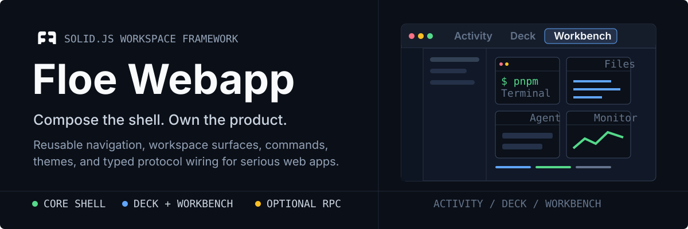
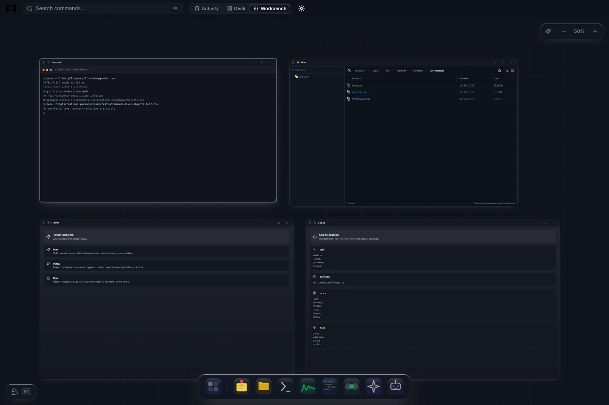
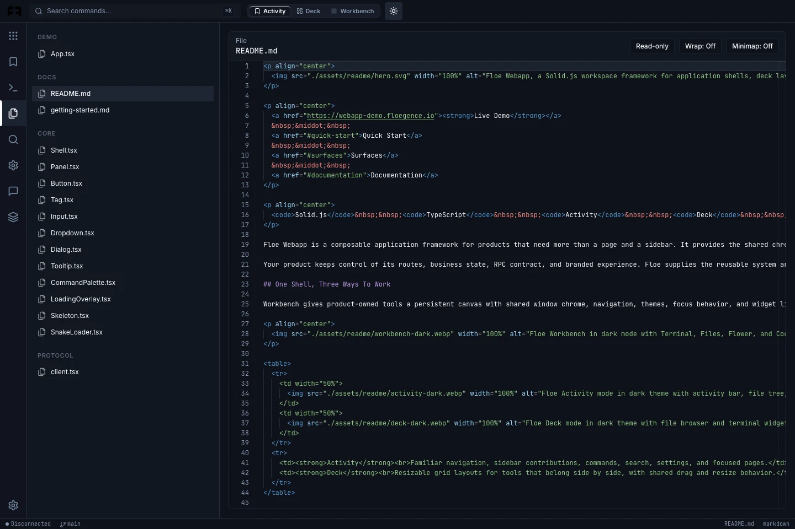
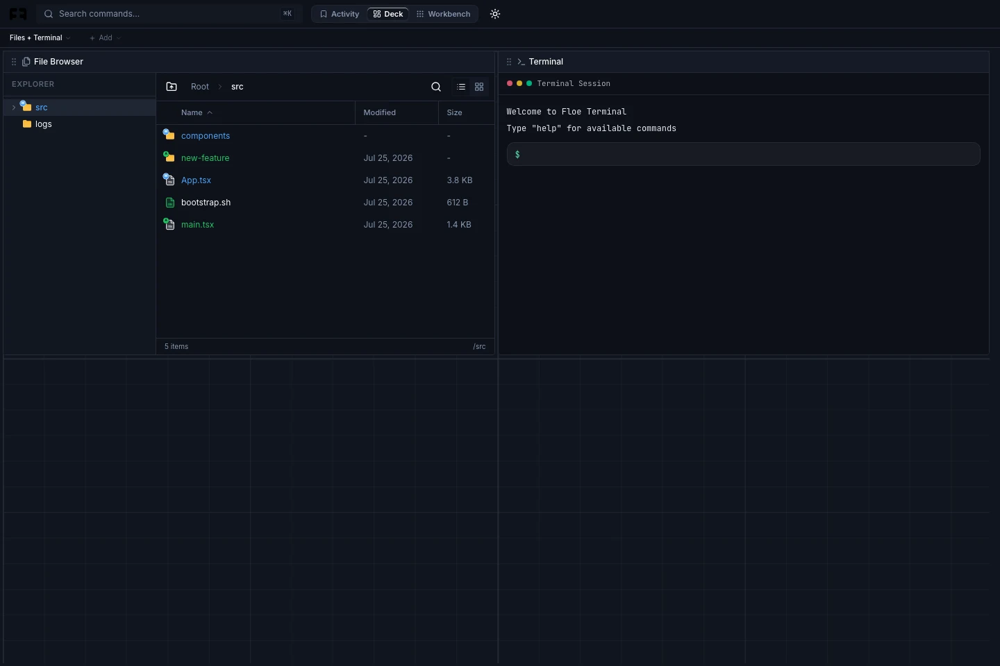

<p align="center">
  
</p>

<p align="center">
  <a href="https://webapp-demo.floegence.io"><strong>Live Demo</strong></a>
  &nbsp;&middot;&nbsp;
  <a href="#quick-start">Quick Start</a>
  &nbsp;&middot;&nbsp;
  <a href="#surfaces">Surfaces</a>
  &nbsp;&middot;&nbsp;
  <a href="#documentation">Documentation</a>
</p>

<p align="center">
  <code>Solid.js</code> &middot; <code>TypeScript</code> &middot; <code>Activity</code> &middot; <code>Deck</code> &middot; <code>Workbench</code>
</p>

Floe Webapp is a composable application framework for products that need more than a page and a sidebar. It provides the shared chrome, interaction contracts, workspace surfaces, and extension points behind file-centric tools, operator consoles, browser companions, and connected SaaS applications.

Your product keeps control of its routes, business state, RPC contract, and branded experience. Floe supplies the reusable system around them.

## One Shell, Three Ways To Work

Workbench gives product-owned tools a persistent canvas with shared window chrome, navigation, themes, focus behavior, and widget lifecycle semantics. The demo opens in work mode with a clean, non-overlapping layout.

<p align="center">
  
</p>

<table>
  <tr>
    <td width="50%">
      
    </td>
    <td width="50%">
      
    </td>
  </tr>
  <tr>
    <td><strong>Activity</strong><br>Familiar navigation, sidebar contributions, commands, search, settings, and focused pages.</td>
    <td><strong>Deck</strong><br>Resizable grid layouts for tools that belong side by side, with shared drag and resize behavior.</td>
  </tr>
</table>

## Why Floe

- **Start with a complete product shell.** Top bar, activity bar, sidebar, bottom bar, mobile navigation, command palette, notifications, and display modes share one layout model.
- **Compose instead of forking.** Register product pages, navigation, commands, status items, and Workbench widgets through public extension contracts.
- **Reuse real workspace surfaces.** File browsing, Monaco editing, terminal integration, chat blocks, Notes, launchpad flows, Deck, and Workbench are built to live together.
- **Keep interaction behavior coherent.** Themes, keyboard navigation, focus, local scrolling, text selection, dialogs, menus, and accessibility patterns are owned at the right surface boundary.
- **Connect only when needed.** The optional protocol package adds reconnect-aware typed RPC without coupling the UI framework to one business contract.

## Quick Start

Create a new application with the scaffolding CLI:

```bash
npx @floegence/floe-webapp-init my-app
cd my-app
pnpm install
pnpm dev
```

The default `minimal` template starts with `FloeApp` and one page. Use the fuller reference application when you want sample pages, settings, and theme switching:

```bash
npx @floegence/floe-webapp-init my-app --template full
```

To add Floe to an existing Solid.js application:

```bash
pnpm add @floegence/floe-webapp-core solid-js
```

Add `@floegence/floe-webapp-protocol` only when the application needs Flowersec-backed sessions or typed remote capabilities. See the [getting started guide](docs/getting-started.md) for styles, providers, and a complete `FloeApp` example.

## Surfaces

| Surface   | What it provides                                                                         | Start here                                       |
| --------- | ---------------------------------------------------------------------------------------- | ------------------------------------------------ |
| App shell | `FloeApp`, `Shell`, navigation bars, panels, commands, notifications, mobile navigation  | [Getting started](docs/getting-started.md)       |
| UI system | Buttons, inputs, dialogs, dropdowns, tooltips, tabs, loading states, menus, theme tokens | [Configuration](docs/configuration.md)           |
| Workspace | File browser, launchpad, chat, editor, terminal helpers, Notes, Deck, Workbench          | [Component registry](docs/component-registry.md) |
| Protocol  | `ProtocolProvider`, `useProtocol()`, `useRpc()`, reconnect-aware typed RPC               | [Protocol](docs/protocol.md)                     |
| Boot      | Session, handshake, and bounded fetch-SSE helpers for browser runtime flows              | [Runtime](docs/runtime.md)                       |

### Activity

Use Activity mode for focused pages inside a familiar application frame. The component registry lets a product contribute sidebar views, commands, settings, and status surfaces without taking ownership of the shell implementation.

### Deck

Use Deck when several tools need stable grid placement. Floe owns snapped drag and resize behavior, shared top-bar integration, and widget chrome while product code supplies the widget bodies.

### Workbench

Use Workbench for a persistent spatial workspace. Product-defined widgets share canvas navigation, window actions, focus and selection semantics, themes, filtering, and optional projected surfaces for pixel-stable editors, terminals, and previews.

Workbench also exposes explicit APIs for centering, fitting, overview navigation, annotations, text, sticky notes, and background regions. The interaction architecture keeps canvas zoom, local scrolling, native text selection, and widget activation separate so rich embedded tools remain predictable.

## How It Fits Together

```text
Your product
  routes + business state + branded views + RPC contract
       |
       v
@floegence/floe-webapp-core
  FloeApp + registry + UI + Activity + Deck + Workbench
       |
       +---- @floegence/floe-webapp-protocol  typed remote capabilities
       |
       +---- @floegence/floe-webapp-boot      multi-window boot helpers
```

The packages are independently consumable:

| Package                           | Role                                                                      |
| --------------------------------- | ------------------------------------------------------------------------- |
| `@floegence/floe-webapp-core`     | Shell, UI primitives, workspace surfaces, themes, and extension contracts |
| `@floegence/floe-webapp-protocol` | Flowersec-aware connection state and typed RPC wiring                     |
| `@floegence/floe-webapp-boot`     | Browser session, handshake, reconnect assembly, and fetch-SSE helpers      |
| `@floegence/floe-webapp-init`     | CLI and templates for new Floe applications                               |

## Documentation

| Goal                                                                | Guide                                                        |
| ------------------------------------------------------------------- | ------------------------------------------------------------ |
| Build and run the first app                                         | [Getting started](docs/getting-started.md)                   |
| Configure strings, storage, keybindings, themes, and shell defaults | [Configuration](docs/configuration.md)                       |
| Register views, commands, navigation, and status contributions      | [Component registry](docs/component-registry.md)             |
| Understand wheel, focus, activation, and selection ownership        | [Interaction architecture](docs/interaction-architecture.md) |
| Adopt the shared accessibility baseline                             | [Accessibility](docs/accessibility.md)                       |
| Connect sessions and typed RPC contracts                            | [Protocol](docs/protocol.md)                                 |
| Build multi-window and sandbox launch flows                         | [Runtime](docs/runtime.md)                                   |
| Work with canonical picker paths                                    | [Picker path semantics](docs/picker-paths.md)                |

## Develop This Repository

Requirements: Node.js `>= 24` and pnpm `>= 9`.

```bash
pnpm install
pnpm dev
```

Useful commands:

```bash
pnpm dev:dist     # run the demo against built package outputs
make check        # lint, typecheck, test, build, and verify distributions
```

The live workspace development server imports `packages/*` source directly for fast startup and HMR. For the Cloudflare Pages demo, build with `pnpm build:demo` and publish `apps/demo/dist` with `NODE_VERSION=24`.

<details>
<summary><strong>AI coding agents</strong></summary>

Load the repository-local Floe skill before implementation:

- `skills/floe-webapp/SKILL.md`
- `skills/floe-webapp/references/playbooks.md`

Scaffolded projects include the same skill package at `./skills/floe-webapp`.

</details>

## Accessibility

Floe targets a reusable WCAG 2.2 AA baseline for shared shell chrome and core interaction primitives. Tabs, menus, dialogs, skip links, landmarks, keyboard navigation, focus ownership, and mobile navigation are designed as framework contracts so downstream products can extend them consistently.

## License

[MIT](LICENSE)
